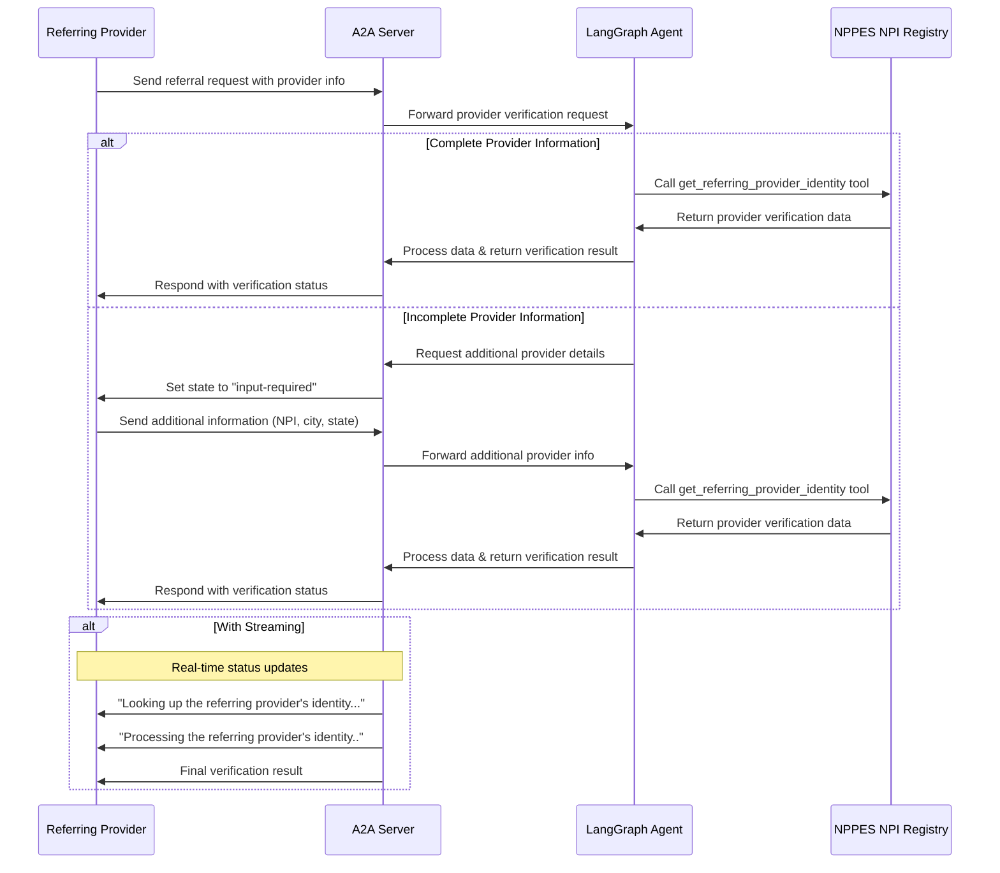

# LangGraph Cardiology Referral Agent with A2A Protocol

This sample demonstrates a healthcare provider verification agent built with [LangGraph](https://langchain-ai.github.io/langgraph/) and exposed through the A2A protocol. It specializes in verifying healthcare provider identities for cardiology referrals to Dr. Walter Reed's clinic, enabling secure and compliant patient referral workflows.

## How It Works

This agent uses LangGraph with LLM (Claude-3.5-Sonnet) to verify healthcare provider identities through the NPPES NPI Registry using a ReAct agent pattern. The A2A protocol enables standardized interaction with the agent, allowing referring providers to verify their credentials for secure patient referrals.



## Key Features

- **Provider Identity Verification**: Uses official NPPES NPI Registry for healthcare provider authentication
- **Multi-turn Conversations**: Agent can request additional information (NPI, location) when needed
- **Real-time Streaming**: Provides status updates during verification processing
- **Push Notifications**: Support for webhook-based notifications
- **Conversational Memory**: Maintains context across verification interactions
- **NPPES Integration**: Direct integration with CMS National Provider Identifier registry

## Prerequisites

- Python 3.12 or higher
- [UV](https://docs.astral.sh/uv/)
- Anthropic API Key for Claude model access

## Setup & Running

1. Navigate to the project directory:

   ```bash
   cd Hl7-language-first-agent
   ```

2. Create an environment file with your API key:

   ```bash
   echo "ANTHROPIC_API_KEY=your_anthropic_api_key_here" > .env
   ```

3. Run the agent:

   ```bash
   # Basic run on default port 10000
   uv run app

   # On custom host/port
   uv run app --host 0.0.0.0 --port 8080
   ```

4. In a separate terminal, run the test client:

   ```bash
   uv run app/test-client.py
   ```

## Build Container Image

Agent can also be built using a container file.

1. Navigate to the project directory:

  ```bash
  cd Hl7-language-first-agent
  ```

2. Build the container file

    ```bash
    podman build . -t langgraph-cardiology-agent
    ```

> [!Tip]  
> Podman is a drop-in replacement for `docker` which can also be used in these commands.

3. Run your container

    ```bash
    podman run -p 10000:10000 -e ANTHROPIC_API_KEY=your_api_key_here langgraph-cardiology-agent
    ```

4. Run A2A client (follow step 4 from the section above)

> [!Important]
> * **Access URL:** You must access the A2A client through the URL `0.0.0.0:10000`. Using `localhost` will not work.
> * **Hostname Override:** If you're deploying to an environment where the hostname is defined differently outside the container, use the `HOST_OVERRIDE` environment variable to set the expected hostname on the Agent Card. This ensures proper communication with your client application.

## Technical Implementation

- **LangGraph ReAct Agent**: Uses the ReAct pattern for reasoning and NPPES tool usage
- **Streaming Support**: Provides incremental updates during provider verification
- **Checkpoint Memory**: Maintains conversation state between verification turns
- **Push Notification System**: Webhook-based updates with JWK authentication
- **A2A Protocol Integration**: Full compliance with A2A specifications
- **NPPES Integration**: Robust error handling and rate limiting for CMS API calls

## Limitations

- Only supports text-based input/output (no multi-modal support)
- Uses NPPES API which may have rate limits during peak usage
- Memory is session-based and not persisted between server restarts
- Provider verification limited to US healthcare providers in NPPES registry

## Examples

**Synchronous provider verification request**

Request:

```
POST http://localhost:10000
Content-Type: application/json

{
    "id": "12113c25-b752-473f-977e-c9ad33cf4f56",
    "jsonrpc": "2.0",
    "method": "message/send",
    "params": {
        "message": {
            "kind": "message",
            "messageId": "120ec73f93024993becf954d03a672bc",
            "parts": [
                {
                    "kind": "text",
                    "text": "I need to verify Dr. John Smith from Chicago, IL for a cardiology referral"
                }
            ],
            "role": "user"
        }
    }
}
```

Response:

```
{
    "id": "12113c25-b752-473f-977e-c9ad33cf4f56",
    "jsonrpc": "2.0",
    "result": {
        "artifacts": [
            {
                "artifactId": "08373241-a745-4abe-a78b-9ca60882bcc6",
                "name": "verification_result",
                "parts": [
                    {
                        "kind": "text",
                        "text": "Found 2 provider(s) matching 'John Smith' in Chicago, IL:\n\n1. Dr. John Michael Smith, MD\n   NPI: 1234567890\n   Status: Active\n   Location: Chicago, IL\n   Enumeration Date: 2015-03-15\n\n2. Dr. John Robert Smith, DO\n   NPI: 0987654321\n   Status: Active\n   Location: Chicago, IL\n   Enumeration Date: 2018-07-22\n\nYour identity has been verified. Please confirm which provider above matches you for accurate referral processing."
                    }
                ]
            }
        ],
        "contextId": "e329f200-eaf4-4ae9-a8ef-a33cf9485367",
        "history": [
            {
                "contextId": "e329f200-eaf4-4ae9-a8ef-a33cf9485367",
                "kind": "message",
                "messageId": "120ec73f93024993becf954d03a672bc",
                "parts": [
                    {
                        "kind": "text",
                        "text": "I need to verify Dr. John Smith from Chicago, IL for a cardiology referral"
                    }
                ],
                "role": "user",
                "taskId": "58124b63-dd3b-46b8-bf1d-1cc1aefd1c8f"
            },
            {
                "contextId": "e329f200-eaf4-4ae9-a8ef-a33cf9485367",
                "kind": "message",
                "messageId": "d8b4d7de-709f-40f7-ae0c-fd6ee398a2bf",
                "parts": [
                    {
                        "kind": "text",
                        "text": "Looking up the referring provider's identity..."
                    }
                ],
                "role": "agent",
                "taskId": "58124b63-dd3b-46b8-bf1d-1cc1aefd1c8f"
            },
            {
                "contextId": "e329f200-eaf4-4ae9-a8ef-a33cf9485367",
                "kind": "message",
                "messageId": "ee0cb3b6-c3d6-4316-8d58-315c437a2a77",
                "parts": [
                    {
                        "kind": "text",
                        "text": "Processing the referring provider's identity.."
                    }
                ],
                "role": "agent",
                "taskId": "58124b63-dd3b-46b8-bf1d-1cc1aefd1c8f"
            }
        ],
        "id": "58124b63-dd3b-46b8-bf1d-1cc1aefd1c8f",
        "kind": "task",
        "status": {
            "state": "completed"
        }
    }
}
```

**Multi-turn provider verification example**

Request - Seq 1:

```
POST http://localhost:10000
Content-Type: application/json

{
    "id": "27be771b-708f-43b8-8366-968966d07ec0",
    "jsonrpc": "2.0",
    "method": "message/send",
    "params": {
        "message": {
            "kind": "message",
            "messageId": "296eafc9233142bd98279e4055165f12",
            "parts": [
                {
                    "kind": "text",
                    "text": "I am Dr. Sarah Johnson and need to refer a patient to Dr Walter Reed"
                }
            ],
            "role": "user"
        }
    }
}
```

Response - Seq 2:

```
{
    "id": "27be771b-708f-43b8-8366-968966d07ec0",
    "jsonrpc": "2.0",
    "result": {
        "contextId": "a7cc0bef-17b5-41fc-9379-40b99f46a101",
        "history": [
            {
                "contextId": "a7cc0bef-17b5-41fc-9379-40b99f46a101",
                "kind": "message",
                "messageId": "296eafc9233142bd98279e4055165f12",
                "parts": [
                    {
                        "kind": "text",
                        "text": "I am Dr. Sarah Johnson and need to refer a patient to Dr Walter Reed"
                    }
                ],
                "role": "user",
                "taskId": "9d94c2d4-06e4-40e1-876b-22f5a2666e61"
            }
        ],
        "id": "9d94c2d4-06e4-40e1-876b-22f5a2666e61",
        "kind": "task",
        "status": {
            "message": {
                "contextId": "a7cc0bef-17b5-41fc-9379-40b99f46a101",
                "kind": "message",
                "messageId": "f0f5f3ff-335c-4e77-9b4a-01ff3908e7be",
                "parts": [
                    {
                        "kind": "text",
                        "text": "To verify your identity for referrals to Dr Walter Reed, I need your complete information. Please provide your city and state, or your NPI number for verification."
                    }
                ],
                "role": "agent",
                "taskId": "9d94c2d4-06e4-40e1-876b-22f5a2666e61"
            },
            "state": "input-required"
        }
    }
}
```

Request - Seq 3:

```
POST http://localhost:10000
Content-Type: application/json

{
    "id": "b88d818d-1192-42be-b4eb-3ee6b96a7e35",
    "jsonrpc": "2.0",
    "method": "message/send",
    "params": {
        "message": {
            "contextId": "a7cc0bef-17b5-41fc-9379-40b99f46a101",
            "kind": "message",
            "messageId": "70371e1f231f4597b65ccdf534930ca9",
            "parts": [
                {
                    "kind": "text",
                    "text": "My NPI is 1234567890 and I practice in Boston, MA"
                }
            ],
            "role": "user",
            "taskId": "9d94c2d4-06e4-40e1-876b-22f5a2666e61"
        }
    }
}
```

Response - Seq 4:

```
{
    "id": "b88d818d-1192-42be-b4eb-3ee6b96a7e35",
    "jsonrpc": "2.0",
    "result": {
        "artifacts": [
            {
                "artifactId": "08373241-a745-4abe-a78b-9ca60882bcc6",
                "name": "verification_result",
                "parts": [
                    {
                        "kind": "text",
                        "text": "Identity verified: Dr. Sarah Elizabeth Johnson, MD\nNPI: 1234567890\nStatus: Active\nLocation: Boston, MA\nYour identity has been successfully verified for referrals to Dr Walter Reed."
                    }
                ]
            }
        ],
        "contextId": "a7cc0bef-17b5-41fc-9379-40b99f46a101",
        "history": [
            {
                "contextId": "a7cc0bef-17b5-41fc-9379-40b99f46a101",
                "kind": "message",
                "messageId": "296eafc9233142bd98279e4055165f12",
                "parts": [
                    {
                        "kind": "text",
                        "text": "I am Dr. Sarah Johnson and need to refer a patient to Dr Walter Reed"
                    }
                ],
                "role": "user",
                "taskId": "9d94c2d4-06e4-40e1-876b-22f5a2666e61"
            },
            {
                "contextId": "a7cc0bef-17b5-41fc-9379-40b99f46a101",
                "kind": "message",
                "messageId": "f0f5f3ff-335c-4e77-9b4a-01ff3908e7be",
                "parts": [
                    {
                        "kind": "text",
                        "text": "To verify your identity for referrals to Dr Walter Reed, I need your complete information. Please provide your city and state, or your NPI number for verification."
                    }
                ],
                "role": "agent",
                "taskId": "9d94c2d4-06e4-40e1-876b-22f5a2666e61"
            },
            {
                "contextId": "a7cc0bef-17b5-41fc-9379-40b99f46a101",
                "kind": "message",
                "messageId": "70371e1f231f4597b65ccdf534930ca9",
                "parts": [
                    {
                        "kind": "text",
                        "text": "My NPI is 1234567890 and I practice in Boston, MA"
                    }
                ],
                "role": "user",
                "taskId": "9d94c2d4-06e4-40e1-876b-22f5a2666e61"
            },
            {
                "contextId": "a7cc0bef-17b5-41fc-9379-40b99f46a101",
                "kind": "message",
                "messageId": "0eb4f200-a8cd-4d34-94f8-4d223eb1b2c0",
                "parts": [
                    {
                        "kind": "text",
                        "text": "Looking up the referring provider's identity..."
                    }
                ],
                "role": "agent",
                "taskId": "9d94c2d4-06e4-40e1-876b-22f5a2666e61"
            },
            {
                "contextId": "a7cc0bef-17b5-41fc-9379-40b99f46a101",
                "kind": "message",
                "messageId": "41c7c03a-a772-4dc8-a868-e8c7b7defc91",
                "parts": [
                    {
                        "kind": "text",
                        "text": "Processing the referring provider's identity.."
                    }
                ],
                "role": "agent",
                "taskId": "9d94c2d4-06e4-40e1-876b-22f5a2666e61"
            }
        ],
        "id": "9d94c2d4-06e4-40e1-876b-22f5a2666e61",
        "kind": "task",
        "status": {
            "state": "completed"
        }
    }
}
```

**Streaming provider verification example**

Request:

```
{
    "id": "6d12d159-ec67-46e6-8d43-18480ce7f6ca",
    "jsonrpc": "2.0",
    "method": "message/stream",
    "params": {
        "message": {
            "kind": "message",
            "messageId": "2f9538ef0984471aa0d5179ce3c67a28",
            "parts": [
                {
                    "kind": "text",
                    "text": "I need to verify Dr. John Smith from Chicago, IL for a cardiology referral"
                }
            ],
            "role": "user"
        }
    }
}
```

Response:

```
data: {"id":"6d12d159-ec67-46e6-8d43-18480ce7f6ca","jsonrpc":"2.0","result":{"contextId":"cd09e369-340a-4563-bca4-e5f2e0b9ff81","history":[{"contextId":"cd09e369-340a-4563-bca4-e5f2e0b9ff81","kind":"message","messageId":"2f9538ef0984471aa0d5179ce3c67a28","parts":[{"kind":"text","text":"I need to verify Dr. John Smith from Chicago, IL for a cardiology referral"}],"role":"user","taskId":"423a2569-f272-4d75-a4d1-cdc6682188e5"}],"id":"423a2569-f272-4d75-a4d1-cdc6682188e5","kind":"task","status":{"state":"submitted"}}}

data: {"id":"6d12d159-ec67-46e6-8d43-18480ce7f6ca","jsonrpc":"2.0","result":{"contextId":"cd09e369-340a-4563-bca4-e5f2e0b9ff81","final":false,"kind":"status-update","status":{"message":{"contextId":"cd09e369-340a-4563-bca4-e5f2e0b9ff81","kind":"message","messageId":"1854a825-c64f-4f30-96f2-c8aa558b83f9","parts":[{"kind":"text","text":"Looking up the referring provider's identity..."}],"role":"agent","taskId":"423a2569-f272-4d75-a4d1-cdc6682188e5"},"state":"working"},"taskId":"423a2569-f272-4d75-a4d1-cdc6682188e5"}}

data: {"id":"6d12d159-ec67-46e6-8d43-18480ce7f6ca","jsonrpc":"2.0","result":{"contextId":"cd09e369-340a-4563-bca4-e5f2e0b9ff81","final":false,"kind":"status-update","status":{"message":{"contextId":"cd09e369-340a-4563-bca4-e5f2e0b9ff81","kind":"message","messageId":"e72127a6-4830-4320-bf23-235ac79b9a13","parts":[{"kind":"text","text":"Processing the referring provider's identity.."}],"role":"agent","taskId":"423a2569-f272-4d75-a4d1-cdc6682188e5"},"state":"working"},"taskId":"423a2569-f272-4d75-a4d1-cdc6682188e5"}}

data: {"id":"6d12d159-ec67-46e6-8d43-18480ce7f6ca","jsonrpc":"2.0","result":{"artifact":{"artifactId":"08373241-a745-4abe-a78b-9ca60882bcc6","name":"verification_result","parts":[{"kind":"text","text":"Identity verified: Dr. John Michael Smith, MD\nNPI: 1234567890\nStatus: Active\nLocation: Chicago, IL\nYour identity has been successfully verified for referrals to Dr Walter Reed."}]},"contextId":"cd09e369-340a-4563-bca4-e5f2e0b9ff81","kind":"artifact-update","taskId":"423a2569-f272-4d75-a4d1-cdc6682188e5"}}

data: {"id":"6d12d159-ec67-46e6-8d43-18480ce7f6ca","jsonrpc":"2.0","result":{"contextId":"cd09e369-340a-4563-bca4-e5f2e0b9ff81","final":true,"kind":"status-update","status":{"state":"completed"},"taskId":"423a2569-f272-4d75-a4d1-cdc6682188e5"}}
```

## Learn More

- [A2A Protocol Documentation](https://a2a-protocol.org/)
- [LangGraph Documentation](https://langchain-ai.github.io/langgraph/)
- [NPPES NPI Registry](https://npiregistry.cms.hhs.gov/)
- [Anthropic Claude API](https://docs.anthropic.com/claude/reference/)

## Disclaimer
Important: The sample code provided is for demonstration purposes and illustrates the mechanics of the Agent-to-Agent (A2A) protocol. When building production applications, it is critical to treat any agent operating outside of your direct control as a potentially untrusted entity.

All data received from an external agent—including but not limited to its AgentCard, messages, artifacts, and task statuses—should be handled as untrusted input. For example, a malicious agent could provide an AgentCard containing crafted data in its fields (e.g., description, name, skills.description). If this data is used without sanitization to construct prompts for a Large Language Model (LLM), it could expose your application to prompt injection attacks. Failure to properly validate and sanitize this data before use can introduce security vulnerabilities into your application.

Developers are responsible for implementing appropriate security measures, such as input validation and secure handling of credentials to protect their systems and users.