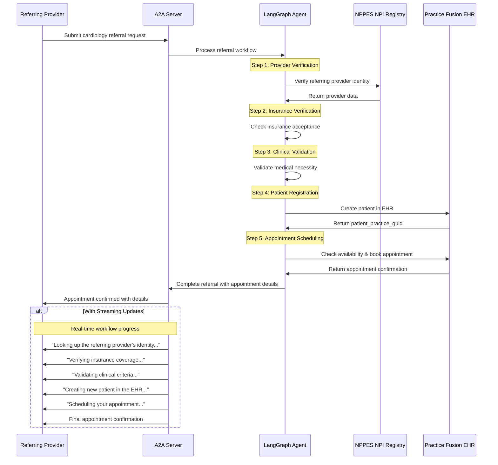

# LangGraph Cardiology Referral Agent with A2A Protocol

This sample demonstrates a complete cardiology referral workflow agent built with [LangGraph](https://langchain-ai.github.io/langgraph/) and exposed through the A2A protocol. It manages the entire process of NEW PATIENT cardiology referrals to Dr. Walter Reed's Manhattan clinic, from provider verification through appointment scheduling with real EHR integration.

## How It Works

This agent uses LangGraph with Claude-3.5-Sonnet to manage a complete 5-step cardiology referral workflow using a ReAct agent pattern. The A2A protocol enables standardized interaction, allowing referring providers to submit complete referrals that result in scheduled appointments with real EHR integration via Practice Fusion API.

### 5-Step Referral Workflow
1. **Provider Verification** - Validates referring provider through NPPES NPI Registry
2. **Insurance Verification** - Confirms accepted insurance coverage (United Healthcare, Aetna, Cigna, BCBS, Kaiser)
3. **Clinical Validation** - Reviews medical necessity and documentation requirements
4. **Patient Registration** - Creates patient record in Practice Fusion EHR system
5. **Appointment Scheduling** - Books real appointment with Dr. Walter Reed (Monday-Friday, 9AM-5PM)



## Key Features

- **Complete Referral Workflow**: End-to-end cardiology referral processing from provider verification to appointment booking
- **Provider Identity Verification**: Uses official NPPES NPI Registry for healthcare provider authentication
- **Insurance Coverage Verification**: Validates accepted insurance plans (United Healthcare, Aetna, Cigna, BCBS, Kaiser)
- **Clinical Criteria Validation**: Reviews medical necessity and documentation requirements for cardiology referrals
- **Real EHR Integration**: Creates actual patient records in Practice Fusion EHR system
- **Live Appointment Scheduling**: Books real appointments with conflict checking and availability validation
- **Multi-turn Conversations**: Agent requests additional information when needed throughout the workflow
- **Real-time Streaming**: Provides status updates during each step of the referral process
- **Push Notifications**: Support for webhook-based notifications
- **Conversational Memory**: Maintains context across the entire referral workflow
- **Dependency Management**: Ensures patient registration completes before appointment scheduling

## Prerequisites

- Python 3.12 or higher
- [UV](https://docs.astral.sh/uv/)
- Anthropic API Key for Claude model access

## Setup & Running

1. Navigate to the project directory:

   ```bash
   cd Hl7-language-first-agent
   ```

2. Create an environment file with your API key:

   ```bash
   echo "ANTHROPIC_API_KEY=your_anthropic_api_key_here" > .env
   ```

3. Run the agent:

   ```bash
   # Basic run on default port 10000
   uv run app

   # On custom host/port
   uv run app --host 0.0.0.0 --port 8080
   ```

4. In a separate terminal, run the test client:

   ```bash
   uv run app/test-client.py
   ```

## Build Container Image

Agent can also be built using a container file.

1. Navigate to the project directory:

  ```bash
  cd Hl7-language-first-agent
  ```

2. Build the container file

    ```bash
    podman build . -t langgraph-cardiology-agent
    ```

> [!Tip]  
> Podman is a drop-in replacement for `docker` which can also be used in these commands.

3. Run your container

    ```bash
    podman run -p 10000:10000 -e ANTHROPIC_API_KEY=your_api_key_here langgraph-cardiology-agent
    ```

4. Run A2A client (follow step 4 from the section above)

> [!Important]
> * **Access URL:** You must access the A2A client through the URL `0.0.0.0:10000`. Using `localhost` will not work.
> * **Hostname Override:** If you're deploying to an environment where the hostname is defined differently outside the container, use the `HOST_OVERRIDE` environment variable to set the expected hostname on the Agent Card. This ensures proper communication with your client application.

## Technical Implementation

- **LangGraph ReAct Agent**: Uses the ReAct pattern for reasoning and healthcare tool orchestration
- **5-Tool Integration**: Provider verification (NPPES), insurance verification, clinical validation, patient creation (Practice Fusion), appointment scheduling (Practice Fusion)
- **Streaming Support**: Provides incremental updates during each workflow step
- **Checkpoint Memory**: Maintains conversation state throughout the entire referral process
- **Push Notification System**: Webhook-based updates with JWK authentication
- **A2A Protocol Integration**: Full compliance with A2A specifications
- **External API Integration**: Robust error handling and rate limiting for NPPES and Practice Fusion APIs
- **Configurable System**: YAML-based configuration for prompts and workflow definition

## Limitations

- **Scope**: Only supports NEW patient cardiology referrals to Dr. Walter Reed's clinic
- **Insurance**: Limited to accepted plans (United Healthcare, Aetna, Cigna, BCBS, Kaiser)
- **Scheduling**: Appointments only available Monday-Friday, 9AM-5PM Eastern
- **Geography**: Provider verification limited to US healthcare providers in NPPES registry
- **Input**: Only supports text-based input/output (no multi-modal support)
- **APIs**: Subject to rate limits from NPPES and Practice Fusion APIs
- **Memory**: Session-based memory not persisted between server restarts

## Examples

**Complete Cardiology Referral Workflow**

Request:

```
POST http://localhost:10000
Content-Type: application/json

{
    "id": "12113c25-b752-473f-977e-c9ad33cf4f56",
    "jsonrpc": "2.0",
    "method": "message/send",
    "params": {
        "message": {
            "kind": "message",
            "messageId": "120ec73f93024993becf954d03a672bc",
            "parts": [
                {
                    "kind": "text",
                    "text": "I'm Dr. Sarah Johnson from Boston, MA (NPI: 1234567890). I need to refer my patient John Doe (DOB: 1980-05-15, United Healthcare, phone: 555-123-4567, email: john.doe@email.com) to Dr. Walter Reed for chest pain evaluation. Patient has recent abnormal ECG and family history of cardiac disease."
                }
            ],
            "role": "user"
        }
    }
}
```

Response (Final):

```
{
    "id": "12113c25-b752-473f-977e-c9ad33cf4f56",
    "jsonrpc": "2.0",
    "result": {
        "artifacts": [
            {
                "artifactId": "08373241-a745-4abe-a78b-9ca60882bcc6",
                "name": "appointment_confirmation",
                "parts": [
                    {
                        "kind": "text",
                        "text": "✅ APPOINTMENT CONFIRMED\n\nPatient: John Doe (MRN: 12345)\nAppointment: Tuesday, October 15, 2024 at 2:00 PM\nDuration: 1 hour\nProvider: Dr. Walter Reed\nLocation: Walter Reed Cardiology Clinic\nAddress: 351 Bowling Green, Ste 200, New York, NY 10001\nConfirmation Number: APT-789012\n\nInstructions: Please arrive 15 minutes early with insurance card and referral documentation\nContact: Walter Reed Cardiology Clinic: (555) 555-0001\n\nYour referral has been successfully processed through our complete 5-step workflow:\n1. ✅ Provider verified (Dr. Sarah Johnson, NPI: 1234567890)\n2. ✅ Insurance accepted (United Healthcare)\n3. ✅ Clinical criteria met (chest pain with abnormal ECG)\n4. ✅ Patient registered in EHR (MRN: 12345)\n5. ✅ Appointment scheduled and confirmed"
                    }
                ]
            }
        ],
        "contextId": "e329f200-eaf4-4ae9-a8ef-a33cf9485367",
        "id": "58124b63-dd3b-46b8-bf1d-1cc1aefd1c8f",
        "kind": "task",
        "status": {
            "state": "completed"
        }
    }
}
```

**Streaming Workflow Example**

For streaming responses, use `/message/stream` endpoint to receive real-time updates during the 5-step process:

```
POST http://localhost:10000
Content-Type: application/json

{
    "id": "6d12d159-ec67-46e6-8d43-18480ce7f6ca",
    "jsonrpc": "2.0",
    "method": "message/stream",
    "params": {
        "message": {
            "kind": "message",
            "messageId": "2f9538ef0984471aa0d5179ce3c67a28",
            "parts": [
                {
                    "kind": "text",
                    "text": "I'm Dr. Sarah Johnson from Boston, MA. I need to refer my patient John Doe for chest pain evaluation. He has United Healthcare insurance."
                }
            ],
            "role": "user"
        }
    }
}
```

Response (streaming):

```
data: {"status":{"message":"Looking up the referring provider's identity...","state":"working"}}
data: {"status":{"message":"Verifying insurance coverage...","state":"working"}}
data: {"status":{"message":"Validating clinical criteria...","state":"working"}}
data: {"status":{"message":"Creating new patient in the EHR...","state":"working"}}
data: {"status":{"message":"Scheduling your appointment...","state":"working"}}
data: {"artifact":{"name":"appointment_confirmation","text":"✅ APPOINTMENT CONFIRMED..."}}
data: {"status":{"state":"completed"}}
```

## Learn More

- [A2A Protocol Documentation](https://a2a-protocol.org/)
- [LangGraph Documentation](https://langchain-ai.github.io/langgraph/)
- [NPPES NPI Registry](https://npiregistry.cms.hhs.gov/)
- [Anthropic Claude API](https://docs.anthropic.com/claude/reference/)

## Disclaimer
Important: The sample code provided is for demonstration purposes and illustrates the mechanics of the Agent-to-Agent (A2A) protocol. When building production applications, it is critical to treat any agent operating outside of your direct control as a potentially untrusted entity.

All data received from an external agent—including but not limited to its AgentCard, messages, artifacts, and task statuses—should be handled as untrusted input. For example, a malicious agent could provide an AgentCard containing crafted data in its fields (e.g., description, name, skills.description). If this data is used without sanitization to construct prompts for a Large Language Model (LLM), it could expose your application to prompt injection attacks. Failure to properly validate and sanitize this data before use can introduce security vulnerabilities into your application.

Developers are responsible for implementing appropriate security measures, such as input validation and secure handling of credentials to protect their systems and users.